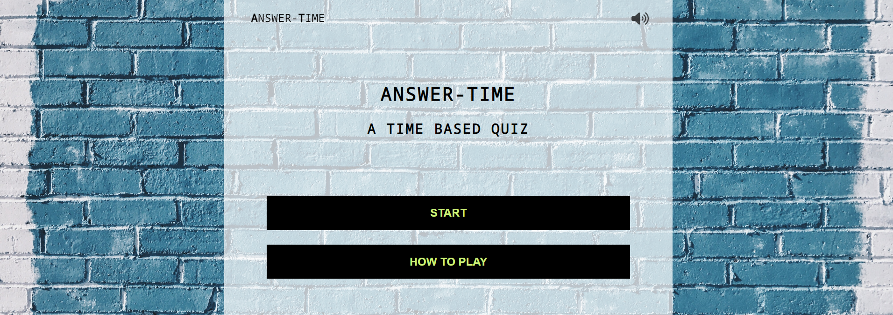

# Answer-Time Quiz

## Introduction

Answer-Time is a time-based quiz game. The game contains multiple quiz types, with a 10 second limit per question. The quicker the answer is provided, the more points are given. 

The interactive code was developed in Javascript and the interface was developed in HTML and CSS.

<a href="https://danielmaherdev.github.io/answertime/" rel="nofolow">Play Answer-Time quiz</a>

