# Answer-Time Quiz

## Introduction

Answer-Time is a time-based quiz game. The game contains multiple quiz types, with a 10 second limit per question. The quicker the answer is provided, the more points are given. 

The interactive code was developed in Javascript and the interface was developed in HTML and CSS.

<a href="https://danielmaherdev.github.io/answertime/" rel="nofolow">Play Answer-Time quiz</a>

## Table of Contents

- [Answer-Time Quiz](#answertime-quiz)
  - [Introduction](#introduction)
  - [Table of Contents](#table-of-contents)
  - [User Experience](#UserExperience)
      - [Strategy](#strategy)
  - [Technologies](#technologies)
  - [Features](#features)
    - [Main Page](#main-page)
    - [Options Menu](#options-menu)
    - [Rules Menu](#rules-menu)
    - [Results Menu](#results-menu)
    - [Game](#game)
  - [Testing](#testing)
  - [Unfixed Bugs](#unfixed-bugs)
  - [Features Left to Implement](#features-left-to-implement)
  - [Deployment](#deployment)
  - [Credits](#credits)
  - [Acknowledgements](#acknowledgements)

 
## Design

This game was designed with a <strong>mobile first</strong> approach. The CSS was built to be compatible with smaller screen sizes first, and was scaled for larger screens where appropriate using media queries.

The game is designed to be as intuitive as possible, with clear distinction for interactive elements via color scheme & hover effects.

It is designed with each section of the game structured in its own div within the HTML, to allow for easier readability, scalability and de-bugging.

## Color Scheme

For this project, I decided to keep the color scheme pretty simple. I felt the below colors fulfilled what I required, with the expection of the 'correct/incorrect' colors shown on the question result screen. In this specific circumstance I opted for more primary colors to best portray the result.

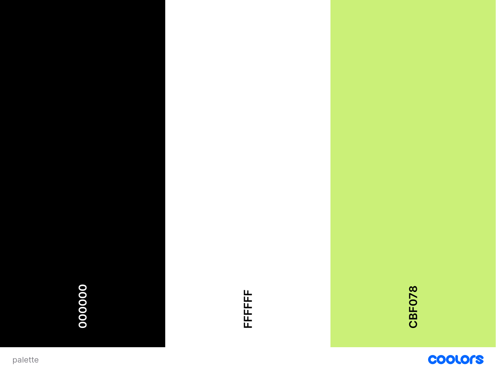

## Wireframe

Due to the simplicity of the design, all devices follow the same structured wireframe, with the only major difference being that the main container for the quiz is set to 50% width on larger screens.

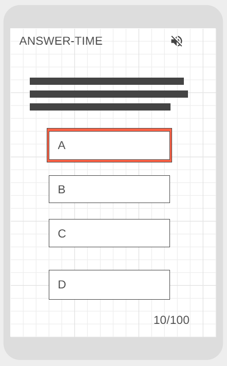

## Technologies

The technologies used in this project were HTML, CSS and JavaScript. The HTML was used to create the structure of the page, the CSS was used to style the page and the JavaScript was used to make the entire game work.

    * HTML5
    * CSS3
    * JavaScript
    * GitHub
    * [Am I Responsive](http://ami.responsivedesign.is/) to test responsiveness

## User Stories

| User story        | Implementation |     
| ------------- |:-------------|
| User wants to be able to toggle audio        | Have added button to turn audiio on/off |     
| User would like to choose a quiz type to be tested on different knowledge       | Added multiple quiz options |     
| User would like to receive costant feedback on progress  | Add overall score to question screen, and add previous questions score to result screen |     
| User would like some instructions, so that they can understand how to play the game.| Add a how to play button to the welcome screen, which shows the user instructions upon clicking |     

## Features

### Welcome Section

The welcome section is the screen the end user is presented with on page load. 

It provides the user with a breif description of the game, along with a start button, and a how to play button. It also contains a logo which redirects to the welcome screen and a toggle for audio, both of which are present on any suqsequent screens.

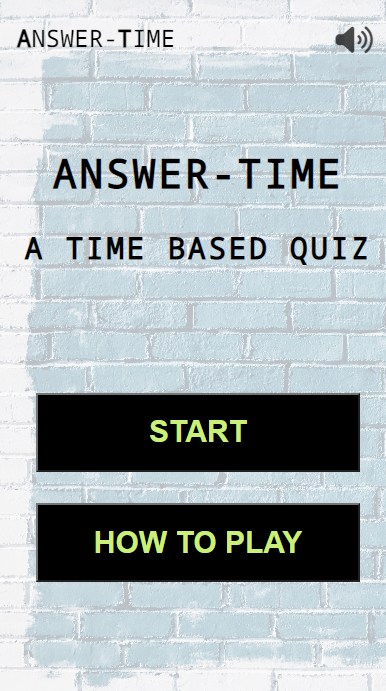

### Choose Game screen

The choose game screen allows the user to choose which quiz type they would like to play (General Knowledge/Music). 

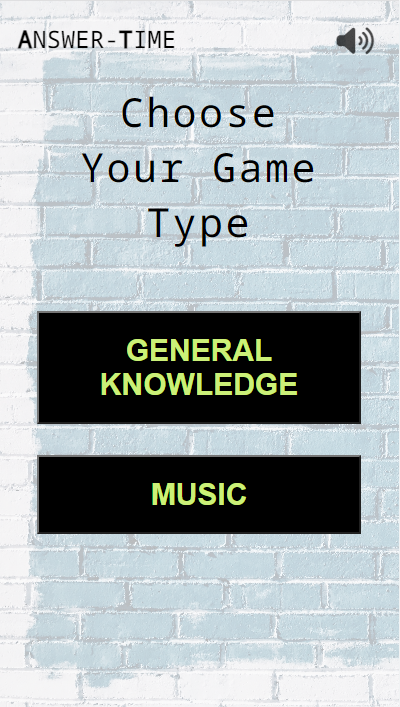

### How to Play screen

The how to play screen provides the user with the guidelines of the game, along with a button to return to the welcome screen.

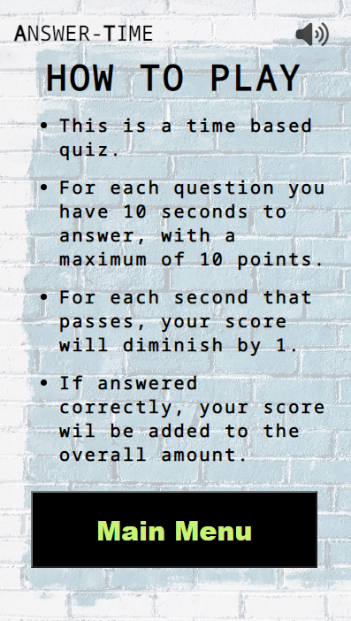

### Question screen

The question screen contains the current question number. It also contains a countdown bar, which decreases every second for 10 seconds. It also contains the current question, along with 4 buttons for each answer.
Finally, it containes the players current overall score, and the total possible score.

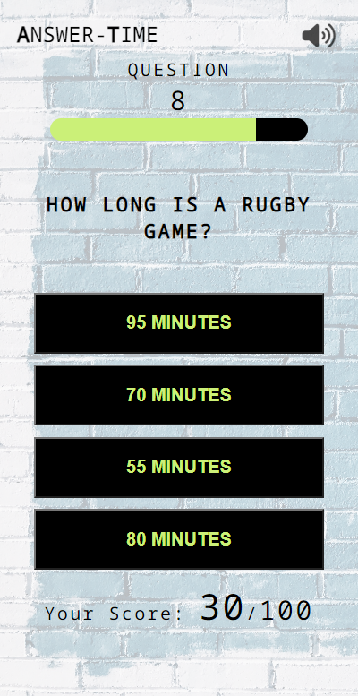

### Correct/Incorrect Answer screen

The correct answer screen displays the selected answer, and the number of seconds it took to select this ansswer. It also displays the number of points added to the overall score. Finally, it displays a button which can be selected to continue to the next question.

The incorrect answer screen simply displays the incorrect selected answer, along with a button to continue to the nect question.

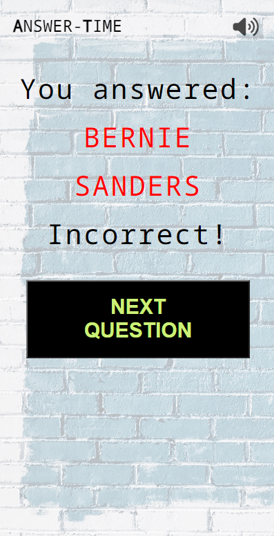

### Timeout Screen

The timeout screen displays if 10 seconds have passed without an answer being selected. This follows the same template as the incorrect answer screen but just contains the text Times Up! along wit a button to proceed.

### Game over screen

This screen displays the result of their final answer, their overall score, and a button to start a new game.

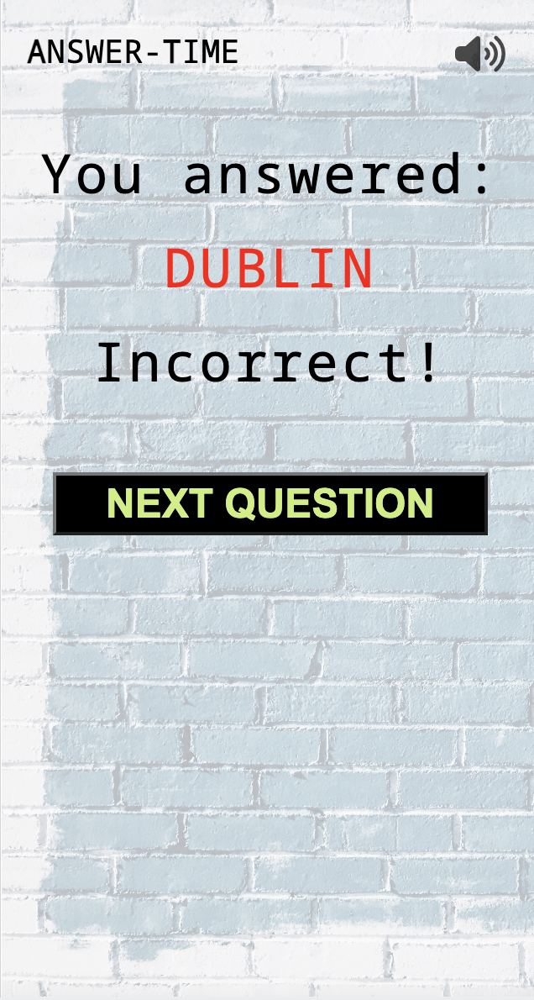

## Testing

This website was tested in the following instances:
 <ul>
  <li>Windows PC running Google Chrome Version 105.0.5195.127 (Official Build) (64-bit)
</li>
<li>MacBook Pro running Google Chrome (version unknown)</li>
<li>Android smartphone running Google Chrome Version 106.0.5249.79</li>
<li>iPhone running Safari</li>
</ul>

W3C Validation:

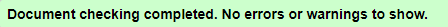 -->

Jigsaw Validation:

Jshint validator was used to validate the JavaScript code.

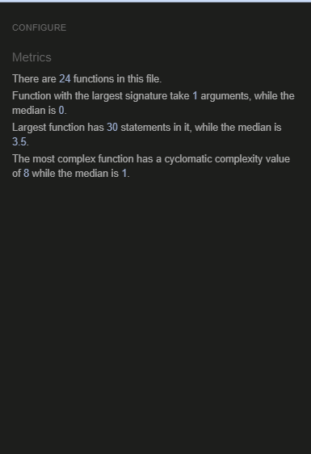

Lighhouse score:

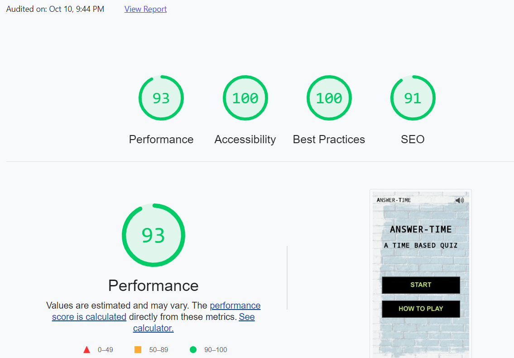

## Resolved Bugs

| Bug        | Resolution      |     
| ------------- |:-------------|
| Timer increased in speed upon each subsequent question      | Yes - Clear timeout on each new question | 
| Timer increased when buttons were clicked multiple times quickly| Yes - Clear timeout on each button click |
| If no answer was selected on the final question, nothing would happen | Yes - created an if/else to check if an answer was selected after timer runs out      | 
| Timer did not function upon selecting new game      | Yes - Reloaded entire page instead of calling function |

 ## Unesolved Bugs

 Bug   
(Unable to replicate currently - but not confirmed resolved) - Occasionally some have previously noticed that the next question would not load after selecting next question

## Features I would like to implement

- Option for different game difficulty (Less time to answer)
- Advanced sound control (music on/off and/or sound effects on/off)
- More quiz games 
- Question randomization
- A leaderboard (when the skills for this have been learned)

# Deployment 
This website is deployed to GitHub.
To deploy to GitHub, I completed the following steps
1. Login or signup to [GitHub](https://github.com/)
2. Find the relevant repo, which is in this case ['answertime'](https://github.com/DanielMaherDev/answertime)
3. Go to the repository settings, and within here select 'pages'
5. Select `main` in the Source drop down box below the 'Build and deployment' title and click save.
6. Wait for the live site to become active. Upon reloading a link will appear for the site

## Credits

- Stack Overflow
- Harry, my mentor
- w3Schools
